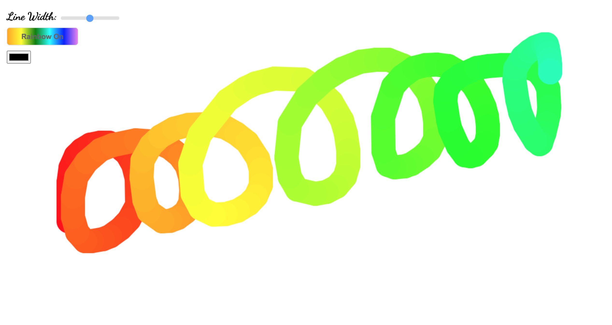

# Type Ahead

Day 8 of Javascript30 by WesBos. Made a HTML5 canvas, where you can draw with your selected colour, or you can swtich to "rainbow colors". You can also set your drawing line width.

# Demo

# Technologies Used

HTML5, CSS, Vanilla JS

# Website

https://buigabor.github.io/HTML5-canvas/
